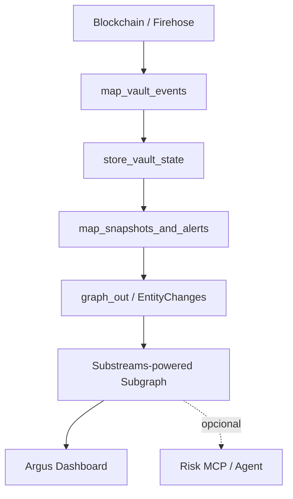

# Argus4626 — Plan de ejecución

**Estado:** activo  
**Fecha:** 2026-09-04  
**Rama actual:** `main`
**Objetivo:** entregar una demo end-to-end competitiva para ETHOnline 2026.

## 1. Norte del proyecto

Argus4626 será una capa de observabilidad y seguridad para bóvedas DeFi compatibles con ERC-4626.

> Una misma infraestructura detecta anomalías de seguridad en bóvedas de protocolos diferentes y las explica visualmente con evidencia on-chain.

El entregable ganador no es un dashboard genérico de TVL. Es un pipeline reutilizable que transforma datos estandarizados de bóvedas ERC-4626 en alertas verificables y fáciles de entender.

## 2. Estrategia para el bounty

### Premio principal

**The Graph — Best Use of Composable or Standardized Graph Products.**

Debemos demostrar:

- un módulo Substreams reutilizable para ERC-4626;
- datos vivos provistos por The Graph;
- un esquema GraphQL común para protocolos heterogéneos;
- una consulta sin lógica específica por protocolo;
- una alerta con evidencia de bloque y transacción.

Las reglas oficiales aceptan construir sobre un esquema estandarizado o componer productos de The Graph, exigen datos vivos y piden hacer visible la ventaja del estándar. También mencionan explícitamente un módulo Substreams para flujos ERC-4626.

Fuentes:

- [ETHGlobal 2026 — premios y requisitos](https://ethglobal.com/events/ethonline2026/prizes)
- [The Graph — recursos para ETHOnline 2026](https://thegraph.com/blog/hackathon-resources/)
- [Substreams — módulos](https://docs.substreams.dev/reference-material/manifest-and-components/modules)

### Premio secundario posible

El mismo núcleo podría extenderse al track **The Graph — Best AI Tooling or AI Use Case**, pero solo después de terminar pipeline y dashboard. Un agente/MCP no forma parte del MVP obligatorio.

## 3. Producto visible

La interfaz principal será un dashboard web, no una terminal.

### Vista principal

```text
Argus4626 — Vault Health Overview

  4 Healthy        1 Warning        1 Critical

  Vault                  Protocol   Share Price   24h Flow   Status
  Steakhouse USDC        Morpho     1.0021        +0.4%      Healthy
  Flagship ETH           Morpho     1.0810        +0.1%      Warning
  yvUSDC                 Yearn      1.3340        -38.2%     Critical

  Incident Radar
  CRITICAL  Share price +11.4% with unchanged supply
            Possible donation/inflation anomaly
```

### Vista de detalle

Debe mostrar:

1. evolución del precio por share;
2. evolución de `totalAssets` y `totalSupply`;
3. depósitos, retiros y transferencias directas del asset;
4. bloque exacto de la alerta;
5. transacción asociada;
6. explicación en lenguaje simple;
7. enlace al explorador.

### Momento central de la demo

```text
Antes:  1,000 assets / 1,000 shares = 1.0000 por share
Evento: transferencia directa de assets sin emitir shares
Después: 1,114 assets / 1,000 shares = 1.1140 por share
Argus:  alerta crítica +11.4%, supply sin cambios
```

La alerta se presentará como **anomalía compatible con donation/inflation**, no como prueba definitiva de un exploit.

## 4. Alcance del MVP

### Obligatorio

- Una sola red inicial: Ethereum Mainnet.
- Dos protocolos o más con bóvedas ERC-4626.
- Una consulta normalizada para todas las bóvedas seleccionadas.
- Substreams en Rust compilado a WASM.
- Estado entre bloques mediante `store`.
- Snapshots por bóveda.
- Detección de inflation/donation-like anomaly.
- Detección de liquidity drain con ventana acumulada.
- Substreams-powered Subgraph desplegado o listo para despliegue.
- Dashboard visual conectado a datos reales.
- Repositorio público con commits incrementales.
- Video de 2 a 4 minutos.

### Targets iniciales

Estas direcciones provienen del contexto inicial y deben validarse durante la ingestión:

- Morpho Steakhouse USDC: `0xBEEF01735c132Ada46AA9aA4c54623cAA92A64CB`
- Morpho Flagship ETH: `0x38989bBA00BDF8181F4082995b3DEAe96163aC5D`
- Yearn yvUSDC: `0xBe53A109B494E5c9f97b9Cd39Fe969BE68BF6204`

Beefy en Arbitrum y las bóvedas adicionales quedan fuera del primer corte.

### Fuera de alcance inicial

- Indexación simultánea multicadena.
- Cinco o más protocolos.
- APY sofisticado.
- `riskScore` subjetivo.
- Contabilidad completa de estrategias externas.
- Ejecución automática de fondos.
- Telegram, Discord y notificaciones externas.
- MCP/agente antes de tener Subgraph y dashboard funcionales.

## 5. Arquitectura objetivo



### `map_vault_events`

Filtra las bóvedas y extrae `Deposit`, `Withdraw`, `Transfer` del asset, bloque, timestamp, log index y transacción. Es stateless y no compara con el bloque anterior.

### `store_vault_state`

Mantiene estado por bóveda: assets observados, shares/supply, retiros de la ventana y último snapshot.

Claves conceptuales:

```text
vault:{address}:assets
vault:{address}:shares
vault:{address}:withdrawn_window
vault:{address}:last_snapshot
```

La forma literal de las claves se ajustará a la API real del store.

### `map_snapshots_and_alerts`

Lee el estado anterior y el nuevo, invoca el núcleo de invariantes y produce snapshots/alertas enriquecidos.

### `graph_out`

Transforma el resultado al formato aceptado por Graph Node y actualiza `Vault`, `VaultSnapshot` y `SecurityAlert`. El formato exacto debe generarse o validarse con el tooling oficial; no se debe inventar un protobuf de EntityChanges.

## 6. Modelo de datos mínimo

### `Vault`

```text
id, protocol, name, symbol, assetAddress
totalAssets, totalSupply, sharePrice, status, lastUpdatedBlock
```

### `VaultSnapshot`

```text
id = vault + block
vault, blockNumber, timestamp
totalAssets, totalSupply, sharePrice, netFlow
```

### `SecurityAlert`

```text
id = transaction + logIndex
vault, alertType, severity, description
deltaMetric, blockNumber, timestamp, transactionHash
```

## 7. Reglas matemáticas

### Inflation/donation-like anomaly

Condiciones:

- snapshot previo con `totalAssets > 0` y `totalSupply > 0`;
- `current.totalAssets > previous.totalAssets`;
- `current.totalSupply == previous.totalSupply`;
- el precio por share aumentó más de 5%.

Comparación exacta:

```text
currentAssets * previousSupply * 10000
>
previousAssets * currentSupply * 10500
```

Los operandos se promueven antes de multiplicar a `U1024`: `U512` no alcanza para el peor caso `U256 × U256 × basis-points`.

Si el baseline está vacío, no se dispara alerta de precio porque aún no hay precio comparable. Ese caso queda reservado para una futura máquina de estados de first deposit.

### Liquidity drain

```text
withdrawn * 10000
>
(available + withdrawn) * 3500
```

La ventana debe acumular múltiples retiros; evaluar eventos aislados permite vaciar la bóveda sin superar el umbral individualmente.

## 8. Riesgo de `totalAssets`

Los eventos `Deposit` y `Withdraw` no describen necesariamente el `totalAssets` real. Una bóveda también puede tener fondos en estrategias externas.

Antes del watchdog completo hay que validar para cada target si podemos usar:

1. cambios de balance del token asset;
2. transferencias directas hacia/desde la bóveda;
3. resultados históricos de `totalAssets()`;
4. cambios de storage relevantes;
5. una bóveda ERC-4626 autocontenida para la demo controlada.

Si no se puede reconstruir `totalAssets` con precisión, se marca la fuente como parcial y no se presenta la alerta como definitiva. Para una demostración controlada se podrá usar una bóveda ERC-4626 de Sepolia, consumiendo sus datos desde un proveedor Graph real.

## 9. Fases y commits

### Fase 0 — Base actual

**Completada.** Crate Rust, invariantes, `U256/U1024`, 8 tests, self-check, documentación, Substreams CLI `v1.22.0` y target WASM.

Commits publicados:

```text
a2d3791 chore: establish Argus4626 project context
172a308 feat: add exact ERC4626 watchdog core
```

### Fase 1 — Esqueleto EVM

**Commit:** `feat: initialize EVM Substreams pipeline`

- ejecutar `substreams init` para EVM;
- conservar invariantes como lógica pura;
- generar protobuf bindings;
- compilar a WASM;
- confirmar autenticación y endpoint.

Salida mínima:

```bash
substreams --version
rustup target list --installed
substreams build
```

### Fase 2 — Stream de actividad

**Commit:** `feat: stream ERC4626 vault activity`

- comenzar con una bóveda;
- confirmar bloques reales;
- filtrar `Deposit` y `Withdraw`;
- agregar `Transfer` del asset;
- sumar targets después de validar la primera.

Salida mínima: `substreams run` devuelve eventos reales con bóveda, bloque y transacción.

### Fase 3 — Estado y snapshots

**Commit:** `feat: track ERC4626 state across blocks`

- agregar store;
- acumular ventana de retiros;
- calcular snapshots;
- distinguir estado inicial de estado comparable;
- probar reejecución histórica determinista.

### Fase 4 — Alertas enriquecidas

**Commit:** `feat: emit ERC4626 security alerts`

- conectar las dos funciones del núcleo;
- agregar vault, bloque, timestamp, hash y métrica;
- etiquetar `CRITICAL`/`WARNING`;
- evitar llamar “attack” a una señal sospechosa.

### Fase 5 — Standard EVM Subgraph in Studio

**Commit:** `feat: expose Argus data through GraphQL`

- conservar `graph_out` como salida reutilizable del paquete Substreams;
- definir el schema ERC-4626 normalizado;
- indexar eventos directamente con `ethereum/contract` y mappings AssemblyScript;
- construir y desplegar el Subgraph estándar en Studio;
- ejecutar una query GraphQL real;
- documentar endpoint sin subir credenciales.

### Fase 6 — Dashboard

**Commit:** `feat: add Argus health dashboard`

- tabla de estados;
- matriz cross-protocol;
- radar de incidentes;
- detalle de bóveda;
- gráfico antes/después;
- enlaces a transacciones.

### Fase 7 — Demo y entrega

**Commit:** `docs: add live demo runbook`

- elegir incidente histórico real o vault de Sepolia;
- documentar bloque y transacción;
- grabar video de máximo 4 minutos;
- revisar README, secrets y reproducibilidad.

### Fase 8 — Pull Request

- revisar diff final;
- abrir PR hacia `main`;
- verificar todos los checks;
- mergear solo con pipeline vivo y dashboard funcional.

## 10. Git y colaboración

- `main` permanece estable;
- cada fase termina en un commit pequeño;
- cada push incluye una validación;
- no usar force push;
- no mezclar frontend, Substreams y deployment en un commit;
- no utilizar Claude ni otros agentes como colaboradores;
- el trabajo se realiza únicamente entre el dueño del repositorio y este agente.

Checklist previo a cada push:

```bash
git diff --check
cargo fmt --check
cargo test
cargo run
```

Cuando exista Substreams:

```bash
substreams build
substreams pack
```

Cuando exista frontend:

```bash
npm run build
```

## 11. Seguridad

Nunca subir `SUBSTREAMS_API_TOKEN`, API keys, claves privadas, `.env` reales ni tokens de deploy.

Sí subir `.env.example`, nombres de variables requeridas, comandos de configuración, endpoints públicos y hashes de transacciones públicas.

## 12. Guion de demo — 3 minutos

### 0:00–0:25 — Problema

ERC-4626 unifica las operaciones, pero la observabilidad y el riesgo siguen fragmentados.

### 0:25–1:05 — Estándar y datos

Mostrar Morpho y Yearn en la misma tabla y explicar:

```text
Firehose → Substreams Rust → Subgraph GraphQL → Argus Dashboard
```

### 1:05–1:55 — Alerta

Mostrar assets aumentando, supply constante, share price superando 5% y aparición de la alerta crítica.

### 1:55–2:30 — Evidencia

Abrir bloque, timestamp, hash de transacción y transferencia del asset.

### 2:30–3:00 — Leverage

Mostrar que el mismo módulo se aplica a distintas bóvedas ERC-4626 sin indexadores separados por protocolo.

## 13. Riesgos y mitigaciones

| Riesgo | Impacto | Mitigación |
|---|---:|---|
| `totalAssets` no se reconstruye universalmente | Alto | Validar primero un target y usar fuente parcial o vault autocontenida |
| Formato incorrecto de `EntityChanges` | Alto | Usar tooling oficial |
| Falta de token del proveedor | Alto | Preparar estructura y configurar token antes del run vivo |
| No aparece una anomalía histórica | Alto | Usar una bóveda ERC-4626 de Sepolia con transacción real |
| Falsos positivos por yield legítimo | Medio | Requerir supply constante y transferencia directa |
| Alcance multicadena | Alto | Ethereum primero; Arbitrum como extensión |
| UI con mocks en la demo | Alto | Demo principal contra Graph real |
| Scope creep | Alto | APY, MCP y automatización son opcionales |

## 14. Definition of Done

- [ ] repositorio público con instrucciones reproducibles;
- [ ] pipeline Substreams compilable;
- [ ] datos reales procesados;
- [ ] estado entre bloques funcionando;
- [ ] Subgraph respondiendo una query real;
- [ ] UI mostrando varias bóvedas/protocolos;
- [ ] alerta visible con evidencia on-chain;
- [ ] explicación entendible sin terminal;
- [ ] ningún secret en Git;
- [ ] video de 2 a 4 minutos;
- [ ] merge desde la rama de trabajo hacia `main`;
- [ ] documentación separando lo implementado de lo futuro.

## 15. Mañana — próxima sesión

### Prioridad 1 — Mejorar la arquitectura visual del README

Sí: usar `draw.io` para crear un diagrama limpio y exportarlo como SVG. El archivo fuente debe quedar versionado para poder iterarlo:

```text
docs/argus4626-architecture.drawio
docs/argus4626-architecture.svg
```

El diagrama debe mostrar, con jerarquía visual clara:

```text
Ethereum Mainnet / Firehose
          │
          ├── Substreams Rust → The Graph Market
          │                         │
          │                         └── state, signals, EntityChanges
          │
          └── Standard EVM Subgraph → Subgraph Studio
                                            │
                                            ▼
                                      Argus Dashboard
```

Requisitos de diseño:

- diferenciar ingestion, computation, indexing y presentation;
- hacer visibles los dos productos de The Graph y sus roles;
- usar la paleta del logo: obsidian, cyan y antique gold;
- mostrar que Morpho y Yearn entran por la misma frontera ERC-4626;
- evitar texto técnico pequeño y flechas cruzadas;
- reemplazar el bloque Mermaid del README solo después de revisar el SVG en GitHub.

### Prioridad 2 — Confirmar el pipeline vivo de Substreams

- [ ] autenticar el CLI usando el token local, sin exponerlo;
- [ ] ejecutar `map_events` sobre un rango corto de Ethereum Mainnet;
- [ ] ejecutar `graph_out` y confirmar `EntityChanges` reales;
- [ ] guardar en `PROJECT_CONTEXT.md` el comando probado y el resultado resumido;
- [ ] decidir cómo hacer visible en la demo el aporte de The Graph Market sin fingir una conexión del frontend.

### Prioridad 3 — Construir una vista forense real

Crear una rama `feat/vault-forensics` y agregar únicamente:

- [ ] ruta de detalle `/vault/[id]`;
- [ ] historial de `VaultSnapshot` con share price;
- [ ] explicación de la alerta en lenguaje simple;
- [ ] bloque, timestamp, hash y enlace a Etherscan;
- [ ] navegación desde la tabla y desde Incident Radar.

### Prioridad 4 — Preparar el caso de demo

- [ ] localizar un incidente histórico real o preparar un caso reproducible en Sepolia;
- [ ] confirmar que la alerta aparece con datos reales y no mocks;
- [ ] capturar el bloque, transacción y secuencia visual antes/después;
- [ ] actualizar el guion de tres minutos con esa evidencia concreta.

### Regla de trabajo

Cada prioridad importante tendrá su propia rama y PR hacia `main`. Primero se valida el resultado técnico, después se hace squash merge. No abrir MCP, APY ni multicadena hasta cerrar estas cuatro prioridades.
