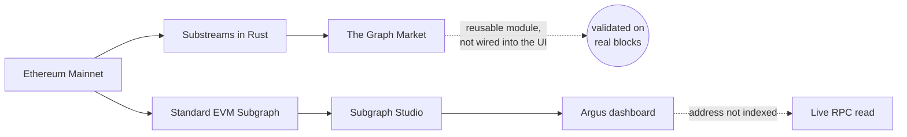

<div align="center">
  
  <p><strong>Vault intelligence for ERC-4626</strong></p>
  <p>See the vault before the risk sees you.</p>
</div>

<p align="center">
  <a href="https://ethglobal.com/showcase/argus4626-re6ou">ETHGlobal Showcase</a>
  &nbsp;·&nbsp;
  <a href="https://www.youtube.com/watch?v=Mgv8QG6rxCo">Demo Video</a>
  &nbsp;·&nbsp;
  <a href="https://ethglobal.com/events/ethonline2026">ETHOnline 2026</a>
  &nbsp;·&nbsp;
  <a href="https://thegraph.market/">The Graph Market</a>
  &nbsp;·&nbsp;
  <a href="https://thegraph.com/studio/">Subgraph Studio</a>
</p>

Argus4626 is an open-source observability layer for ERC-4626 vaults. It turns a shared standard into a reusable pipeline for tracking vault activity, comparing share-price behavior, and surfacing suspicious on-chain movements with evidence — for any vault that speaks ERC-4626, not just the ones it already indexes.

> One standard. Many vaults. One monitoring pipeline.

## The idea

ERC-4626 standardizes how applications deposit and withdraw from tokenized vaults. It does not standardize how teams monitor accounting, performance, or risk.

Argus4626 applies the same event and state pipeline to heterogeneous vaults from Morpho and Yearn. The dashboard presents the result as an operating view rather than a terminal log: a vault matrix, historical share-price trends, a tactical radar of tracked vaults and alerts, and an evidence-first incident feed.

## What the demo shows

- Live Ethereum Mainnet data from three ERC-4626 vaults (Morpho, Yearn), one normalized GraphQL model.
- A stateful Rust Substreams watchdog processing block data, deterministic share-price tracking with integer arithmetic (no floats, no silent overflow).
- **Four security invariants**, each with a real, reproduced on-chain incident as evidence (see below) — not just a description.
- A live, on-demand lookup for **any** ERC-4626 vault address, indexed or not: paste an address and Argus reads `totalAssets`/`totalSupply` straight from an RPC and reconstructs a real share-price history from past blocks.
- Alerts linked to the indexed block and transaction, viewable directly on Etherscan.

## The four invariants — and a real incident for each

Argus compares state between blocks without floating-point arithmetic, e.g. for donation/inflation:

```text
currentAssets × previousSupply × 10000
>
previousAssets × currentSupply × 10500
```

| Invariant | Trigger | Severity | Live proof (Sepolia) |
| --- | --- | --- | --- |
| Donation / inflation attack | Share price up >5% while supply is unchanged | Critical | [`/vault/sepolia-demo`](https://argus4626.alva-p.xyz/vault/sepolia-demo) |
| Liquidity drain | A withdrawal removes >35% of available liquidity | Warning | [`/vault/liquidity-demo`](https://argus4626.alva-p.xyz/vault/liquidity-demo) |
| Share price crash | Share price down >5% while supply is unchanged | Critical | [`/vault/sim-demo`](https://argus4626.alva-p.xyz/vault/sim-demo) |
| Unbacked mint | Supply up enough to move price >5% while assets are unchanged | Critical | [`/vault/sim-demo`](https://argus4626.alva-p.xyz/vault/sim-demo) |

These are monitoring signals, not definitive proof of an exploit. Every alert links back to its block and transaction so it can be independently verified.

Donation/inflation and liquidity drain both reproduce on a plain, unmodified OpenZeppelin `ERC4626` vault. A stock vault always ties supply and assets together, so crash and unbacked-mint needed one small demo-only contract (`sepolia-demo/src/SimVault.sol`) with two owner-only functions — `simulateLoss` and `simulateUnbackedMint` — used only to generate the real transactions Argus then detects; nothing about the invariant math itself is simulated.

## Architecture



The two Graph products are parallel tracks off the same entry point, not one pipe — Subgraph Studio does not accept the Substreams-powered `graph_out` adapter today, so the dashboard queries the Standard EVM Subgraph directly:

| Layer | Role |
| --- | --- |
| Substreams + The Graph Market | Reusable Rust watchdog: stateful metrics and `EntityChanges`, validated live against real blocks. Proves the bounty's Substreams module — not the dashboard's data source. |
| Standard EVM Subgraph + Subgraph Studio | Normalized GraphQL entities, same schema, same invariant math (AssemblyScript). This is what the dashboard actually queries for tracked vaults. |
| Live RPC lookup | For any vault address the Subgraph hasn't indexed: a direct `eth_call` reads current and historical state to reconstruct a snapshot with no indexing step. |
| Argus dashboard | A visual control plane for vault health, trends, and incidents. |

## Monitored vaults

| Vault | Protocol | Network | Asset |
| --- | --- | --- | --- |
| Steakhouse USDC | Morpho MetaMorpho | Ethereum Mainnet | USDC |
| Flagship ETH | Morpho MetaMorpho | Ethereum Mainnet | WETH |
| yvUSDC | Yearn V3 | Ethereum Mainnet | USDC |

The same ERC-4626 event boundary is reused across all three vaults; only display metadata changes. Any other vault address works too, through the live RPC lookup — try pasting `0x83F20F44975D03b1b09e64809B757c47f942BEeA` (Savings Dai) into the dashboard's search box.

## Sepolia incident evidence

| Vault | Address | Incident | Transaction |
| --- | --- | --- | --- |
| DemoVault | `0x099CaB8F6B806B99CDAb9FB120ae8D684F8E6Ddd` | Donation/inflation | [`0x0748967a…`](https://sepolia.etherscan.io/tx/0x0748967ad9b718686a9270dc5a415804cab7b0e63bd51dbb62142232beef4fc2) |
| LiquidityDemoVault | `0x18c5A7ab3602680dd18fB5f074c3662f473c93f1` | Liquidity drain | [`0x88e2687e…`](https://sepolia.etherscan.io/tx/0x88e2687e8233014e22d02cbf37cff822e57e1f4543a042476b835c3af014d30e) |
| SimVault | `0x90bba5d49163dbF3F20C4f4d562307E03Bb34AB0` | Share price crash | [`0x332a534c…`](https://sepolia.etherscan.io/tx/0x332a534cf804681ab8a283700bf06cf87775fe49eb4e7294128dfb5f90be7b87) |
| SimVault | `0x90bba5d49163dbF3F20C4f4d562307E03Bb34AB0` | Unbacked mint | [`0x298782c6…`](https://sepolia.etherscan.io/tx/0x298782c60809c9d9fad82e7461db30f38fc467a28a49af0ff6906fdf4ad143e9) |

Verify the invariant math directly against these captured values:

```bash
cargo run --example sepolia_case
```

## Try the live data

```text
https://api.studio.thegraph.com/query/1758674/argus-4626-ethereum-mainnet/0.1.2
```

```graphql
{
  vaults {
    id
    name
    protocol
    assetSymbol
    sharePrice
    totalAssets
    lastUpdatedBlock
  }
}
```

## Quickstart

### Requirements

- Rust with `wasm32-unknown-unknown`.
- Substreams CLI `v1.22.0` or newer.
- `buf`.
- Node.js 22 or newer.
- A Substreams API token from [The Graph Market](https://thegraph.market/).
- (Optional, for the live any-vault lookup's historical chart) an RPC endpoint with archive access, e.g. a free Alchemy or Infura key.

### Build and test the pipeline

```bash
cargo fmt --check
cargo test
cargo run
substreams auth
. ./.substreams.env
substreams build substreams.yaml
```

Run the package against live Ethereum data:

```bash
substreams run \
  -e mainnet.eth.streamingfast.io:443 \
  argus4626-v0.1.0.spkg \
  graph_out \
  -s 18941135 \
  -t +1 \
  -o jsonl
```

### Build the Subgraph

```bash
npx --yes @graphprotocol/graph-cli@0.98.1 codegen subgraph/subgraph.yaml
npx --yes @graphprotocol/graph-cli@0.98.1 build subgraph/subgraph.yaml
```

### Run the dashboard

```bash
cd frontend
cp .env.example .env.local
npm install
npm run dev
```

Open `http://localhost:3000`. `ARGUS_RPC_URL` in `.env.local` powers the live any-vault lookup; without archive access, that lookup still returns a current snapshot, just without historical points.

## Repository

```text
abi/                 ERC-4626-compatible ABI
proto/               Protobuf schemas
src/                 Substreams modules and invariant checks
subgraph/            Studio schema, manifest, and mappings (Ethereum Mainnet)
subgraph-sepolia/    Studio schema, manifest, and mappings (Sepolia incident demos)
sepolia-demo/        Foundry project for the demo contracts and deploy scripts
examples/            Runnable sanity checks against captured Sepolia values
frontend/            Argus dashboard (Next.js)
substreams.yaml      Package and module graph
```

## Current status

- Rust Substreams package: built and tested, 15/15 unit tests passing.
- `graph_out` EntityChanges: implemented and live-tested.
- Standard EVM Subgraph (Mainnet): deployed to Subgraph Studio, tracking 3 real vaults.
- Standard EVM Subgraph (Sepolia): deployed to Subgraph Studio, tracking 3 demo vaults with all 4 invariants reproduced live.
- Dashboard: live GraphQL data, live RPC lookup for untracked vaults, tactical radar, collapsible sidebar.

## MVP boundary

`observed_assets` is an explicit MVP proxy based on ERC-20 transfers involving each vault. It is not a universal replacement for `totalAssets()` when a vault allocates funds across external strategies. Argus therefore labels its signals as transparent telemetry and keeps the accounting limitation visible.

## Links

- [ETHGlobal Showcase](https://ethglobal.com/showcase/argus4626-re6ou)
- [Demo video](https://www.youtube.com/watch?v=Mgv8QG6rxCo)
- [ETHOnline 2026](https://ethglobal.com/events/ethonline2026)
- [The Graph documentation](https://thegraph.com/docs/en/)
- [The Graph Market](https://thegraph.market/)
- [Substreams documentation](https://docs.substreams.dev/)
- [ERC-4626 specification](https://eips.ethereum.org/EIPS/eip-4626)

## License

Built in public for ETHOnline 2026.
