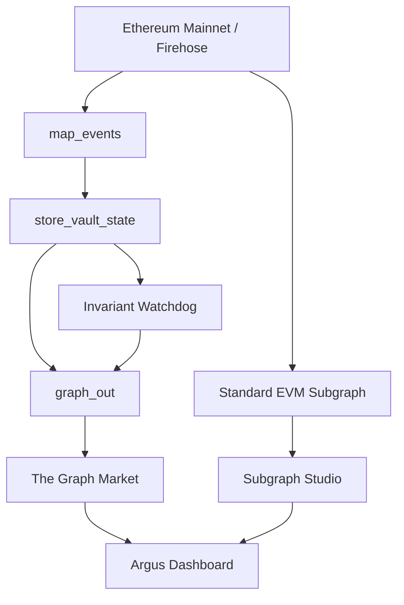

# Argus4626

### An open ERC-4626 vault watchdog powered by The Graph Market and Subgraph Studio

Argus4626 turns the common ERC-4626 interface into a reusable observability and security pipeline. It watches heterogeneous vaults, normalizes their activity, tracks state between blocks, and prepares the data for a GraphQL dashboard that explains suspicious behavior with on-chain evidence.

> **One standard. Many vaults. One monitoring pipeline.**

Argus is inspired by **Argos Panoptes**, the hundred-eyed giant from Greek mythology: a metaphor for watching many vaults at the same time.

## Why this matters

ERC-4626 standardized how applications interact with tokenized vaults through `deposit`, `mint`, `withdraw`, and `redeem`. It did not standardize how developers monitor performance, accounting, or risk.

As a result, vault analytics are often fragmented across protocol-specific indexers and heuristics. Argus4626 uses the standard event surface as a common interface and applies the same pipeline to vaults from different protocols.

## What Argus does

The current MVP:

- Decodes standard ERC-4626 `Deposit` and `Withdraw` events.
- Observes ERC-20 transfers into and out of tracked vaults to detect direct asset movements.
- Tracks observed assets and share supply with a stateful Substreams store.
- Computes a deterministic share-price ratio without floating-point arithmetic.
- Implements inflation/donation and liquidity-drain invariant checks.
- Emits reusable `EntityChanges` through `graph_out` for Substreams consumers.
- Provides a standard EVM Subgraph for Subgraph Studio with the same normalized vault model.

The dashboard is the next product layer: it will turn this indexed data into a cross-protocol health matrix, historical charts, and an incident radar.

## The demo in one minute

```text
Firehose block ──► Substreams package ──► The Graph Market
                     │
                     ├── stateful metrics
                     ├── invariant watchdog
                     └── reusable EntityChanges output

Ethereum Mainnet ──► Standard EVM Subgraph ──► Subgraph Studio GraphQL
                                              │
                                              ▼
                                      Argus dashboard
                               cross-protocol health + evidence
```

The visual story is simple:

```text
Before:  1,000 assets / 1,000 shares = 1.0000 share price
Event:   assets move directly into the vault without new shares
After:   1,114 assets / 1,000 shares = 1.1140 share price
Argus:   critical anomaly — price jumped while supply stayed unchanged
```

The signal is reported as an anomaly compatible with a donation/inflation attack. It is not presented as definitive proof of an exploit.

## Standards leverage

The same Rust module and the same GraphQL entity model are applied to vaults from multiple protocols:

| Vault | Protocol | Network | Underlying asset |
| --- | --- | --- | --- |
| Steakhouse USDC | Morpho MetaMorpho | Ethereum Mainnet | USDC |
| Flagship ETH | Morpho MetaMorpho | Ethereum Mainnet | WETH |
| yvUSDC | Yearn V3 | Ethereum Mainnet | USDC |

There is no protocol-specific event decoder in the pipeline. The common ERC-4626 event signatures provide the reusable boundary; protocol metadata is only used to label the resulting entities.

## Architecture



### Substreams core

`map_events` is stateless and extracts normalized ERC-4626 activity from Firehose blocks. `store_vault_state` carries state across blocks so downstream modules can compare previous and current values.

### Invariant watchdog

Inflation/donation detection uses cross-multiplication instead of division:

```text
currentAssets * previousSupply * 10000
>
previousAssets * currentSupply * 10500
```

This represents a share-price increase above 5% while the share supply remains unchanged. Arithmetic is promoted to `U1024` so the comparison remains safe at the theoretical `uint256` boundary.

Liquidity-drain detection uses the same integer-only approach for withdrawals exceeding 35% of the reconstructed pre-withdrawal liquidity.

### Graph output

`graph_out` emits the official `sf.substreams.sink.entity.v1.EntityChanges` protobuf shape for reusable Substreams consumers. The standard EVM Subgraph in Studio exposes:

- `Vault`: protocol labels and latest observed state.
- `VaultSnapshot`: block-level history for charting and forensic inspection.
- `SecurityAlert`: evidence-backed inflation anomalies.

## Quickstart

### Requirements

- Rust toolchain with `wasm32-unknown-unknown` installed.
- Substreams CLI `v1.22.0` or newer.
- `buf` for protobuf generation.
- Node.js 22 or newer for Graph CLI validation.
- A Substreams API token from [The Graph Market](https://thegraph.market/).

### Build and test the Rust module

```bash
cargo fmt --check
cargo test
cargo run
substreams build substreams.yaml
```

### Authenticate and run against live Ethereum data

```bash
substreams auth
. ./.substreams.env

substreams run \
  -e mainnet.eth.streamingfast.io:443 \
  argus4626-v0.1.0.spkg \
  map_events \
  -s <START_BLOCK> \
  -t <STOP_BLOCK> \
  -o jsonl
```

The `.substreams.env` file contains a secret JWT and must never be committed or exposed in frontend code.

### Validate `graph_out`

The package starts at block `18941135`. The following command verifies that the output is valid `EntityChanges` and creates the initial vault entities:

```bash
substreams run \
  -e mainnet.eth.streamingfast.io:443 \
  argus4626-v0.1.0.spkg \
  graph_out \
  -s 18941135 \
  -t +1 \
  -o jsonl
```

### Validate the Subgraph manifest

```bash
npx --yes @graphprotocol/graph-cli@0.98.1 codegen subgraph/subgraph.yaml
npx --yes @graphprotocol/graph-cli@0.98.1 build subgraph/subgraph.yaml
```

## Repository layout

```text
.
├── abi/                         ERC-4626-compatible ABI input
├── proto/                       Event and EntityChanges protobuf schemas
├── src/
│   ├── invariants.rs            Integer-only security checks
│   ├── entity_changes.rs        Minimal EntityChanges helpers
│   └── lib.rs                   Substreams map, store, and graph_out modules
├── subgraph/
│   ├── schema.graphql           Normalized vault and alert entities
│   ├── src/mapping.ts           Standard EVM event mappings
│   ├── package.json             Graph CLI and AssemblyScript dependencies
│   └── subgraph.yaml            Subgraph Studio manifest
├── substreams.yaml              Package and module graph
├── PLAN.md                      Hackathon execution plan
└── PROJECT_CONTEXT.md           Technical handoff and decisions
```

## Project status

| Area | Status |
| --- | --- |
| ERC-4626 event extraction | Implemented |
| Stateful vault aggregation | Implemented |
| Integer-only invariant core | Implemented and tested |
| `graph_out` EntityChanges | Implemented and live-tested on the initial block |
| Standard EVM Subgraph for Studio | Built successfully with Graph CLI |
| Security alerts in the Substreams watchdog | Implemented and tested |
| Dashboard UI | Next product layer |
| MCP/agent interface | Optional after the dashboard |

## Known MVP boundaries

`observed_assets` is an explicit MVP proxy based on ERC-20 transfers involving the vault. It is not a complete replacement for `totalAssets()` when a vault allocates funds across external strategies. The first deployment therefore focuses on transparent telemetry and clearly labeled anomaly signals rather than claiming protocol-independent accounting perfection.

Ethereum Mainnet is the first deployment target. Arbitrum will be added as a separate package/Subgraph deployment and unified at the frontend layer.

## Hackathon objective

Argus4626 is built for the ETHOnline 2026 **The Graph — Best Use of Composable or Standardized Graph Products** bounty. The intended proof is concrete:

1. A reusable Rust Substreams module processes live blockchain data.
2. A stateful store computes comparable vault metrics across protocols.
3. A standard EVM Subgraph in Studio exposes the normalized GraphQL model.
4. The dashboard makes the Substreams and Subgraph roles visible in one experience.
5. Every incident links back to a block, metric change, and transaction.

## Links

- [The Graph documentation](https://thegraph.com/docs/en/)
- [The Graph Market](https://thegraph.market/)
- [Substreams documentation](https://docs.substreams.dev/)
- [ERC-4626 specification](https://eips.ethereum.org/EIPS/eip-4626)
- [Execution plan](./PLAN.md)
- [Technical project context](./PROJECT_CONTEXT.md)

## License

This project is being built in public for ETHOnline 2026.
