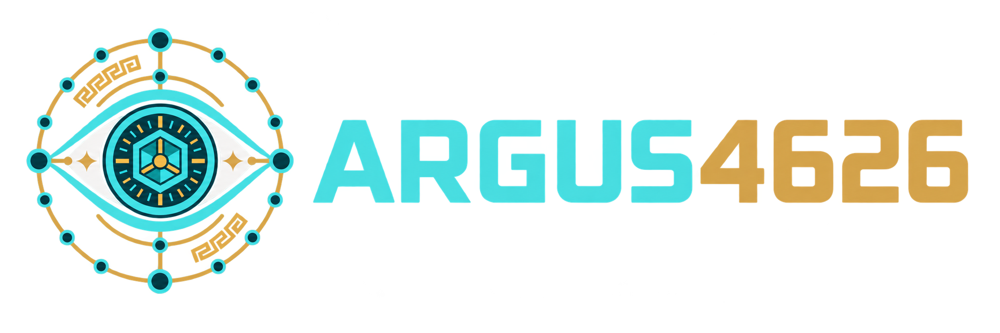
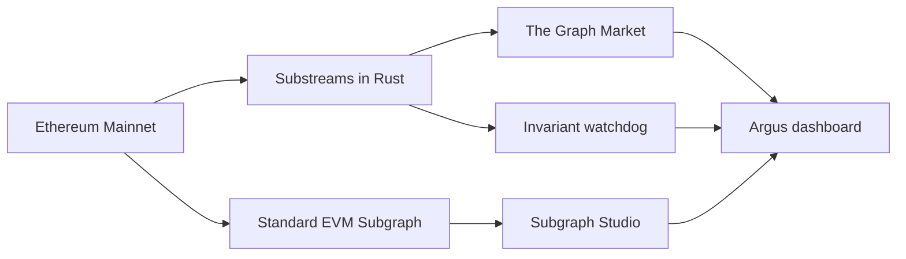

<div align="center">
  
  <p><strong>Vault intelligence for ERC-4626</strong></p>
  <p>See the vault before the risk sees you.</p>
</div>

<p align="center">
  <a href="https://ethglobal.com/events/ethonline2026">ETHOnline 2026</a>
  &nbsp;·&nbsp;
  <a href="https://thegraph.market/">The Graph Market</a>
  &nbsp;·&nbsp;
  <a href="https://thegraph.com/studio/">Subgraph Studio</a>
</p>

Argus4626 is an open-source observability layer for ERC-4626 vaults. It turns a shared standard into a reusable pipeline for tracking vault activity, comparing share-price behavior, and surfacing suspicious on-chain movements with evidence.

> One standard. Many vaults. One monitoring pipeline.

## The idea

ERC-4626 standardizes how applications deposit and withdraw from tokenized vaults. It does not standardize how teams monitor accounting, performance, or risk.

Argus4626 applies the same event and state pipeline to heterogeneous vaults from Morpho and Yearn. The dashboard presents the result as an operating view rather than a terminal log: a vault matrix, historical share-price trends, and an evidence-first incident radar.

## What the demo shows

- Live Ethereum Mainnet data from three ERC-4626 vaults.
- One normalized GraphQL model across Morpho and Yearn.
- A stateful Rust Substreams watchdog processing block data.
- Deterministic share-price tracking with integer arithmetic.
- Donation/inflation and liquidity-drain invariant signals.
- Alerts linked to the indexed block and transaction evidence.

## Architecture



The two Graph products have distinct roles:

| Layer | Role |
| --- | --- |
| Substreams + The Graph Market | High-throughput block processing, stateful metrics, and reusable `EntityChanges` output. |
| Standard EVM Subgraph + Subgraph Studio | Normalized GraphQL entities for the product UI and external consumers. |
| Argus dashboard | A visual control plane for vault health, trends, and incidents. |

## Security signals

Argus compares state between blocks without floating-point arithmetic.

```text
currentAssets × previousSupply × 10000
>
previousAssets × currentSupply × 10500
```

When share price rises by more than 5% while share supply remains unchanged, Argus emits a critical donation/inflation signal. Withdrawals above 35% of reconstructed pre-withdrawal liquidity within the rolling window emit a liquidity-drain warning.

These are monitoring signals, not definitive proof of an exploit. Every alert is intended to be investigated against its block and transaction.

## Monitored vaults

| Vault | Protocol | Network | Asset |
| --- | --- | --- | --- |
| Steakhouse USDC | Morpho MetaMorpho | Ethereum Mainnet | USDC |
| Flagship ETH | Morpho MetaMorpho | Ethereum Mainnet | WETH |
| yvUSDC | Yearn V3 | Ethereum Mainnet | USDC |

The same ERC-4626 event boundary is reused across all three vaults; only display metadata changes.

## Try the live data

The current Subgraph Studio endpoint is:

```text
https://api.studio.thegraph.com/query/1758674/argus-4626-ethereum-mainnet/0.1.2
```

Example query:

```graphql
{
  vaults {
    id
    name
    protocol
    assetSymbol
    sharePrice
    totalAssets
    lastUpdatedBlock
  }
}
```

## Quickstart

### Requirements

- Rust with `wasm32-unknown-unknown`.
- Substreams CLI `v1.22.0` or newer.
- `buf`.
- Node.js 22 or newer.
- A Substreams API token from [The Graph Market](https://thegraph.market/).

### Build and test the pipeline

```bash
cargo fmt --check
cargo test
cargo run
substreams auth
. ./.substreams.env
substreams build substreams.yaml
```

Run the package against live Ethereum data:

```bash
substreams run \
  -e mainnet.eth.streamingfast.io:443 \
  argus4626-v0.1.0.spkg \
  graph_out \
  -s 18941135 \
  -t +1 \
  -o jsonl
```

### Build the Subgraph

```bash
npx --yes @graphprotocol/graph-cli@0.98.1 codegen subgraph/subgraph.yaml
npx --yes @graphprotocol/graph-cli@0.98.1 build subgraph/subgraph.yaml
```

### Run the dashboard

```bash
cd frontend
cp .env.example .env.local
npm install
npm run dev
```

Open `http://localhost:3000`. The endpoint is configured server-side and is not exposed as part of the product UI.

## Repository

```text
abi/                 ERC-4626-compatible ABI
proto/               Protobuf schemas
src/                 Substreams modules and invariant checks
subgraph/            Studio schema, manifest, and mappings
frontend/            Argus dashboard
substreams.yaml      Package and module graph
PLAN.md              Hackathon execution plan
PROJECT_CONTEXT.md   Technical decisions and handoff
```

## Current status

- Rust Substreams package: built and tested.
- `graph_out` EntityChanges: implemented and live-tested.
- Standard EVM Subgraph: deployed to Subgraph Studio.
- Dashboard: implemented with live GraphQL data.
- Mainnet vault registry: Morpho and Yearn.

## MVP boundary

`observed_assets` is an explicit MVP proxy based on ERC-20 transfers involving each vault. It is not a universal replacement for `totalAssets()` when a vault allocates funds across external strategies. Argus therefore labels its signals as transparent telemetry and keeps the accounting limitation visible.

## Links

- [ETHOnline 2026](https://ethglobal.com/events/ethonline2026)
- [The Graph documentation](https://thegraph.com/docs/en/)
- [The Graph Market](https://thegraph.market/)
- [Substreams documentation](https://docs.substreams.dev/)
- [ERC-4626 specification](https://eips.ethereum.org/EIPS/eip-4626)
- [Execution plan](./PLAN.md)
- [Technical project context](./PROJECT_CONTEXT.md)

## License

Built in public for ETHOnline 2026.
